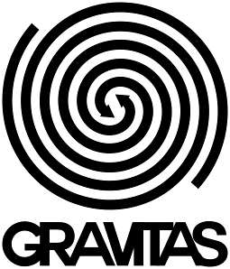
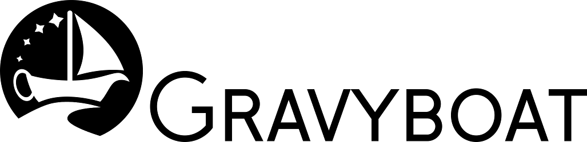

# Gravitas NEUROTIC

This branch uses tensorflow to create a neural network AI.
However tensorflow is not supported on windows, therefore you must *not*
merge this branch onto master, people will get angry.

A project to complete the Games and Agents course.
This project will try to emulate gravwell, the board game.
It'll also try to create a good AI for that (the agents part).

---

Created by Team Gravyboat.

